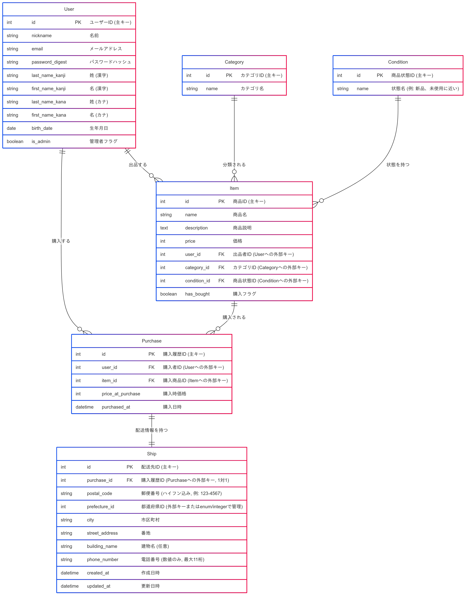

# DemoEC - Eコマースデモアプリケーション

商品リスト、ユーザーアカウント、ショッピングカート機能、注文処理を備えた総合的なEコマースプラットフォームです。

## システム設計

## 機能

- ユーザー認証とプロフィール管理
- カテゴリーと検索機能を備えた商品カタログ
- ショッピングカートと決済プロセス
- 注文履歴と追跡
- 在庫管理用の管理者ダッシュボード

## はじめ方

### 前提条件
- `.ruby-version`で指定されているRubyバージョン
- Railsフレームワーク
- 設定されているデータベースシステム

### インストール
1. このリポジトリをクローンする
2. `bundle install`を実行する
3. `rails db:create db:migrate`でデータベースをセットアップする
4. `rails server`でサーバーを起動する

## ER図（テーブル定義とアソシエーション）

### Userテーブル (users)

|Column|Type|Options|
|---|---|---|
|id|bigint|null: false, primary_key: true|
|nickname|string|null: false|
|email|string|null: false, unique: true|
|encrypted_password|string|null: false|
|last_name_kanji|string|null: false|
|first_name_kanji|string|null: false|
|last_name_kana|string|null: false|
|first_name_kana|string|null: false|
|birth_date|date|null: false|
|is_admin|boolean|null: false, default: false|
|created_at|datetime|null: false|
|updated_at|datetime|null: false|

#### Association
- has_many :items, foreign_key: "user_id"
- has_many :purchases, foreign_key: "user_id"
---

### Itemテーブル (items)

|Column|Type|Options|
|---|---|---|
|id|bigint|null: false, primary_key: true|
|name|string|null: false|
|description|text|null: false|
|price|integer|null: false|
|category_id|integer|null: false|
|condition_id|integer|null: false|
|has_bought|boolean|null: false, default: false|
|created_at|datetime|null: false|
|updated_at|datetime|null: false|

#### Association

- belongs_to :user
- belongs_to :category
- belongs_to :condition
- has_many :purchases (または、在庫管理の概念により has_one :purchase の場合もある)
    

---

### Categoryテーブル (categories)

|Column|Type|Options|
|---|---|---|
|id|bigint|null: false, primary_key: true|
|name|string|null: false, unique: true|
|created_at|datetime|null: false|
|updated_at|datetime|null: false|

#### Association

- has_many :items
    

---

### Conditionテーブル (conditions)

|Column|Type|Options|
|---|---|---|
|id|bigint|null: false, primary_key: true|
|name|string|null: false, unique: true|
|created_at|datetime|null: false|
|updated_at|datetime|null: false|

#### Association

- has_many :items
---

### Purchaseテーブル (purchases)
|   |   |   |
|Column|Type|Options|
|---|---|---|
|id|bigint|null: false, primary_key: true|
|user|references|null: false, foreign_key: true|
|item|references|null: false, foreign_key: true|
|created_at|datetime|null: false|
|updated_at|datetime|null: false|

#### Association

- belongs_to :user
- belongs_to :item
- has_one :ship

## Shipテーブル (ships)

|Column|Type|Options|説明|
|---|---|---|---|
|id|bigint|null: false, primary_key: true|配送先ID (主キー)|
|purchase|references|null: false, foreign_key: true, unique: true|購入履歴ID (Purchaseへの外部キー, 1対1の関係のためunique制約)|
|postal_code|string|null: false|郵便番号 (ハイフン込み, 例: "123-4567")|
|prefecture_id|integer|null: false|都道府県ID (ActiveHash等で管理する想定。または文字列型)|
|city|string|null: false|市区町村|
|street_address|string|null: false|番地|
|building_name|string|null: true|建物名 (任意入力)|
|phone_number|string|null: false|電話番号 (数値のみ, 最大11桁。バリデーションで制御)|
|created_at|datetime|null: false|作成日時|
|updated_at|datetime|null: false|更新日時|

#### Association
- belongs_to :purchase
